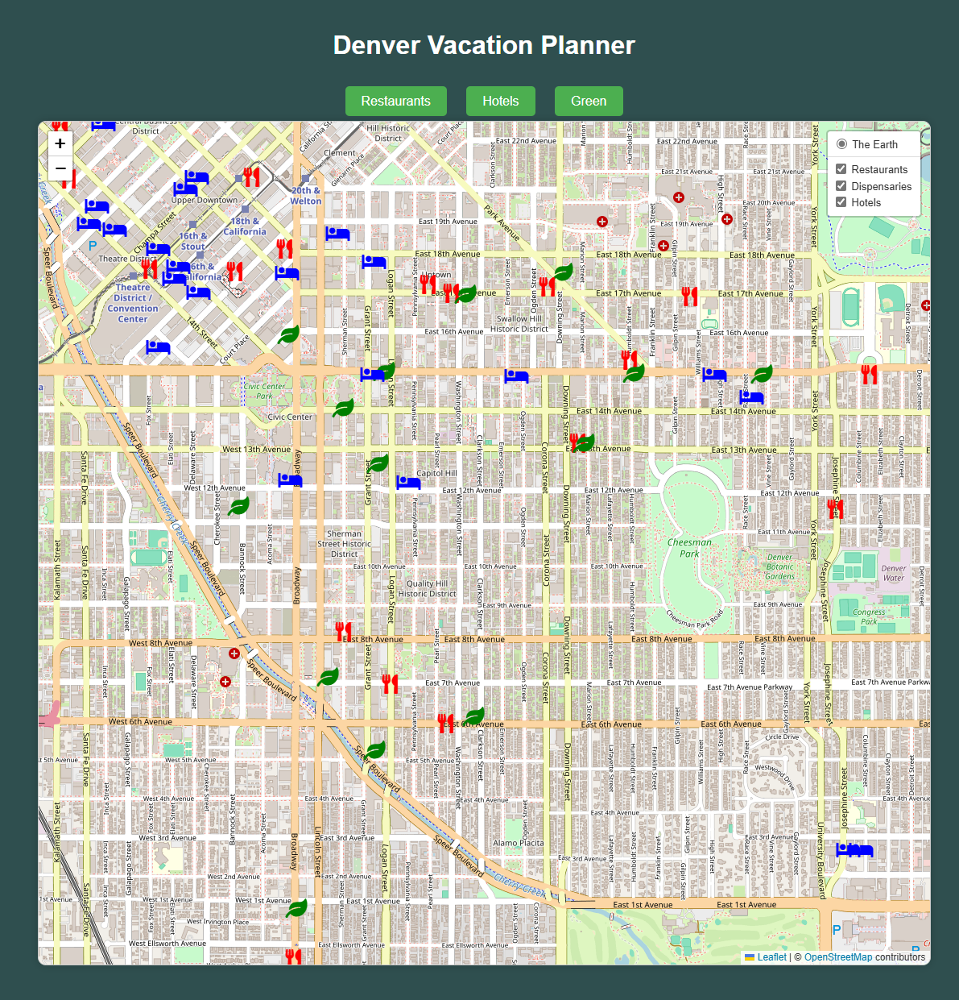

=============================

OVERVIEW & PURPOSE
- 
We, the jellyRoots, built an app to assist in planning our upcoming vacation in Denver, CO. While we understand an API call could be performed directly on a webpage, we wanted to highlight a broader range of tools and assets that have been covered in our data science class. Regardless, we're poor students so this API key will be deprecated soon. 

The project begins with retrieving data from the Yelp API, which is then systematically stored in an SQL database. Using Flask, we will access and read this stored data to dynamically generate and serve the relevant information on a webpage. Once the data is successfully hosted, we will leverage JavaScript and HTML, specifically using the Leaflet library, to develop interactive and visually engaging map-based visualizations. These visualizations will provide users with an intuitive and comprehensive overview of restaurants, hotels, and other points of interest in the Denver metropolitan area.

GRADER INSTRUCTIONS
-
To run this app, you'll need to first install psycopg like any other Python package, using ``pip`` to download it from PyPI_::

    $ pip install psycopg2

1. Clone the repository <a href='https://github.com/famndox/P3-jellyRoots.git'>P3-jellyRoots.git</a> 
2. Replace the "password" with your "pgAdminPassword" in these scripts:
     - line 47 of ***yelp_data_retrieval.py***
     - line 15 of ***app.py*** 
3. Open pgAdmin and create a new database named _"yelp_data"_ (all lowercase)(all defaults)
4. Then you may run the ***YelpSQL.sql*** in _"yelp_data"_ to frame the necessary tables and columns
5. Next run the ***yelp_data_retrieval.py*** script to populate the database
6. Finally, run the ***app.py*** to re-JSON-ify the SQL database and *build* the ***index.html*** with it's supporting, *static*, ***style.css*** and ***logic.js***

   

ETHICAL CONSIDERATIONS
- 
In the course of this project, we have made several ethical considerations, particularly regarding the inclusion of cannabis/marijuana businesses in our search results. Denver, Colorado, is known for its legal cannabis industry, and while some users may find value in this information, others may prefer it to be excluded. Therefore, we have ensured that our application provides an option to filter out cannabis/marijuana businesses based on user preference. This approach respects the diverse needs and values of our users, promoting inclusivity and respect for different viewpoints.

One of the key ethical considerations in our project is deciding whether or not to include cannabis/marijuana businesses in our search results. Denver, Colorado, has a legal cannabis industry, and the presence of these businesses can be a point of contention for various users. Here are the considerations we made regarding this issue:

Inclusivity and Respect for Users' Preferences:
- Some users may find value in knowing the locations of cannabis businesses, either for patronage or to avoid them. Providing an option to include or exclude these businesses respects the diverse preferences and needs of our user base.
  
Public Perception and Legal Context:
- While cannabis is legal in Colorado, it remains a regulated substance, and the perception of its inclusion in searches can vary widely among users, especially those from regions where it remains illegal or socially stigmatized.
  
Transparency and User Control:
- Allowing users to toggle the visibility of cannabis businesses promotes transparency and gives them control over their search results. This empowers users to customize their experience according to their comfort levels and needs.

Impact on Business Owners:
- Including cannabis businesses in the search results can provide them with visibility and support from users who are looking for these services. Conversely, giving users the option to exclude them also respects the privacy and comfort of users who prefer not to engage with these businesses.
  
Implementation: 
- To address these ethical considerations, we have implemented a feature that allows users to filter out cannabis/marijuana businesses from the search results. This ensures that users have the choice and flexibility to view the information that is most relevant and appropriate for them.

  
REFERENCES
-

<a href='https://github.com/Leaflet/Leaflet'><333 Leaflet <333</a> 
<a href='https://github.com/lennardv2/Leaflet.awesome-markers?utm_source=cdnjs&utm_medium=cdnjs_link&utm_campaign=cdnjs_library'>Leaflet.Awesome-Markers</a> 
<a href='https://pngtree.com/freepng/natural-hills-and-mountains_4103445.html'>mountain range from pngtree.com</a> 
<a href='https://www.theleagueofmoveabletype.com/blackout'>**BLACKOUT** from the *The Leauge of Moveable Type*</a> 

jellyRoots
-
<a href='https://github.com/Alliekj'>Allie J.</a> 
<a href='https://github.com/KillerTwinkie7'>Grayson P.</a> 
<a href='https://github.com/famndox'>James B.</a> 
<a href='https://github.com/KrisMelton'>Kris M.</a> 
<a href='https://github.com/Trevor-Sandoval'>Trevor S.</a> 
<a href='https://docs.google.com/presentation/d/1_xz7i0G1DPjxy1GtI8R1DYicbaYTCayyHuQkljrD3Rw/edit?usp=sharing'>Presentation</a> 
